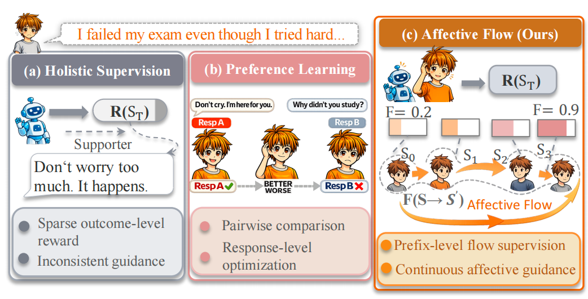
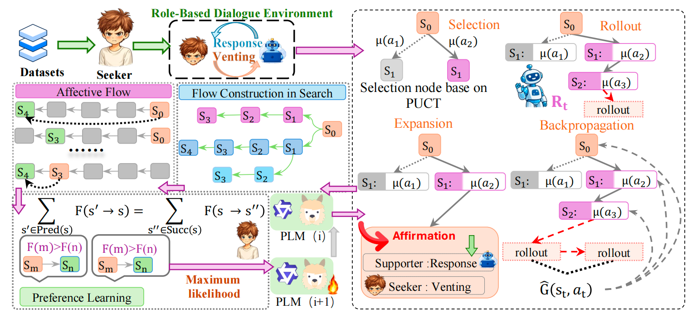
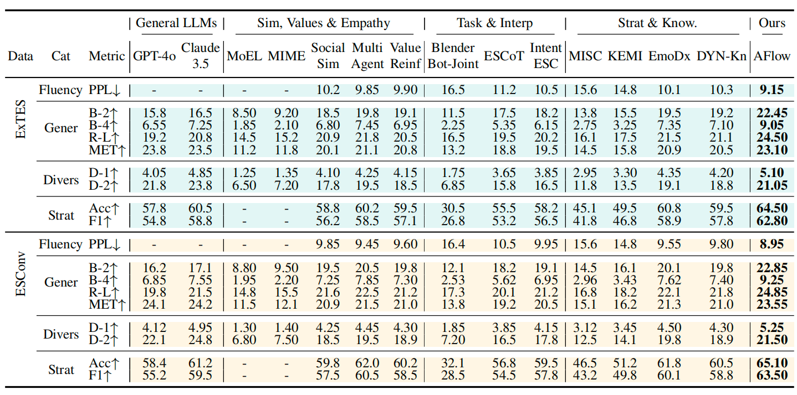
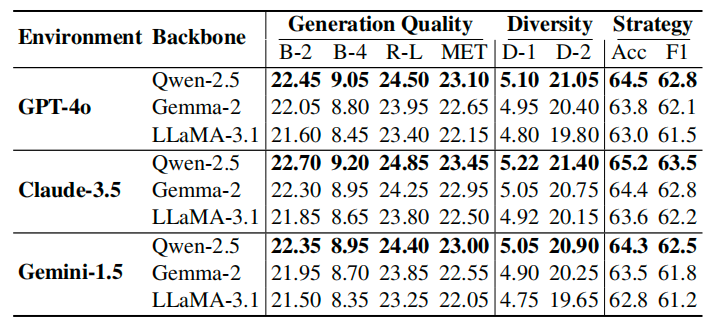
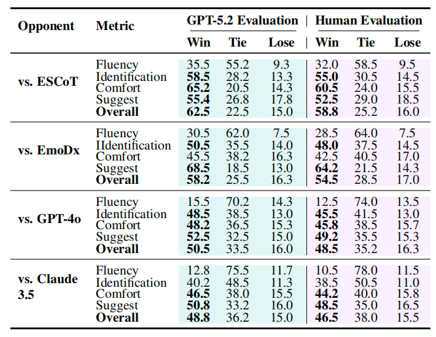
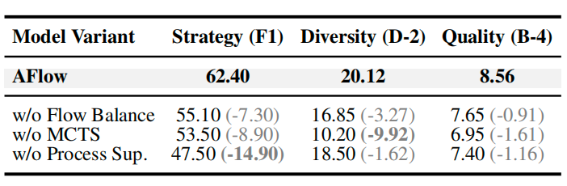

<table align="center">
  <tr>
    <td align="center" valign="middle" style="border: none;">
      
    </td>
    <td align="center" valign="middle" style="border: none; padding-left: 12px;">
      <span style="font-size: 40px; font-weight: 800; line-height: 1;">AFlow</span>
    </td>
  </tr>
</table>
<!-- <p align="center">
  <!-- Logo (replace file) -->
  
  <h1 align="center">AFlow</h1>
</p> -->

<!-- <h1 align="center">AFlow</h1> -->

<h1 align="center">
  <b>Affective Flow Language Model for Emotional Support Conversation</b>
</h1>

<!-- Badges Row (edit to match your paper) -->
<p align="center">
  <!-- <a href="YOUR_PAPER_URL"></a>&nbsp; -->
  <a href="YOUR_ARXIV_URL"></a>&nbsp;
  <!-- &nbsp; -->
  <a href="LICENSE"></a>&nbsp;
  &nbsp;
  
</p>

<!-- Quick Nav (edit anchors to match your sections) -->
<p align="center">
  <a href="#overview">📄 Overview</a> •
  <a href="#methodology">🔬 Methodology</a> •
  <a href="#quick-start">🚀 Quick Start</a> •
  <a href="#results">📊 Results</a> •
  <a href="#configuration">📝 Configuration</a>
</p>


## Affective Flow

Implementation of **AFlow (Affective Flow Language Model)** for **Emotional Support Conversation (ESC)**, with **search-distilled Affective Flow Preference Optimization (AFPO)**.

<!-- ====== Figure 1 Placeholder ====== -->
<p align="center">
  
</p>
<p align="center">
  <em>Figure 1: Comparison of Emotional Support Conversation approaches</em>
</p>

---

## 📄Overview

Large language models (LLMs) have been widely applied to **Emotional Support Conversation (ESC)**, yet **multi-turn** support remains difficult. Effective support requires making **consistent strategy decisions** across turns, while many alignment approaches provide supervision mainly at the response/outcome level, offering limited guidance for **intermediate** strategy choices.

**AFlow** learns from **search-distilled multi-turn trajectories** and introduces **prefix-level supervision**. It treats a dialogue prefix as a decision state and a supportive strategy as the decision variable at each step. AFlow jointly learns:
- a **strategy policy** for selecting strategies given a prefix, and
- an **evaluation/value model** for assessing candidate strategies under the current prefix,

and optimizes them with **AFPO**, which applies **subpath-level flow-balance** constraints over prefixes so that learning signals from later turns can be propagated back to earlier decision points.

At inference time, AFlow performs **lightweight strategy selection** by combining the policy preference and the value signal, then generates the response conditioned on the chosen strategy.

---

## Key Features

### 1) Modeling
AFlow formulates multi-turn ESC as sequential decisions on dialogue prefixes, where the model selects a supportive strategy at each step before generating the response.

### 2) MCTS distillation
AFlow uses MCTS to explore multi-turn continuations under different strategies and distills the resulting trajectory trees into training signals for both the strategy policy and the evaluation/value model.

### 3) AFPO training
AFPO enforces **subpath-level flow-balance** over dialogue prefixes to provide **prefix-consistent** supervision, improving credit assignment for intermediate strategy decisions.

### 4) Inference
AFlow selects strategies using the learned policy and value signals, avoiding expensive test-time search while maintaining stable strategy coherence.


## 🔬Methodology

<!-- ====== Figure 2 Placeholder ====== -->
<p align="center">
  
</p>
<p align="center">
  <em>Figure 2: Detailed diagram of the AFlow framework for emotional support conversation</em>
</p>

---

## 📊 Results

### Automatic evaluation (Table 1)

AFlow shows consistent improvements over competitive baselines on two ESC datasets (**ExTES** and **ESConv**) across:
- **Strategy alignment** (Accuracy / Macro-F1)
- **Generation quality** (BLEU, ROUGE-L, METEOR, PPL)
- **Diversity** (Distinct-1/2)

### Robustness across backbones (Table 2)

AFlow remains effective across diverse backbone LLMs (e.g., Qwen-2.5 / Gemma-2 / LLaMA-3.1) under different environments (e.g., GPT-4o / Claude-3.5).

### Pairwise preference evaluation (Table 3)

AFlow is compared against baselines using **GPT-5.2 judge** and **Human Experts** (Win/Tie/Lose %s).  

### Ablation (Table 4)

Removing any core component causes clear degradation:

<div style="overflow-x: auto; white-space: nowrap; border: 1px solid rgba(255,255,255,0.12); border-radius: 12px; padding: 10px;">
  
  
  
  
</div>
<p align="center">
  <sub>Scroll horizontally to view Tables 1–4.</sub>
</p>

## Project Structure

```text
Emo_Flow_DPO/
├── scripts/                # Training, tree generation, and data processing
│   ├── build_ex_tree.py    # MCTS tree generation
│   ├── extract_paths.py    # Extract training trajectories from trees
│   ├── train_afpo.py       # AFDPO / Flow-Balance training entry
│   ├── run_pipeline.sh     # End-to-end pipeline (tree → analysis → paths)
│   └── run_train.sh        # Training launcher (verify params inside)
├── analyze/                # Tree stats and visualization
│   ├── count_trees.py
│   └── draw_tree.py
├── configs/                # Config files
│   └── train_emoflow.yaml
├── data/                   # Data and prompts
│   ├── raw/                # Raw datasets (exconv / extes)
│   ├── prompt.json
│   ├── strategies.json
│   └── evaluation_metrics.json
├── requirements.txt        # Python dependencies
└── README.md
````

---

## Requirements

* Python 3.10+
* PyTorch (install the CUDA/CPU build that matches your hardware)
* Other dependencies in `requirements.txt`
* For API-based MCTS: set `OPENAI_API_KEY` and configure `models.*.api_base` in `configs/train_emoflow.yaml`

---

## 🚀Quick Start

###  1. Install Environment

```bash
conda create -n emoflow python=3.10 -y
conda activate emoflow

# Install PyTorch (choose the right CUDA/CPU build)
pip install torch torchvision torchaudio

# Install project dependencies
pip install -r requirements.txt
```

Optional: configure accelerate for multi-GPU.

```bash
pip install accelerate
accelerate config
```

### 2. Download Base Model

* Set `afpo_training.model_name` in `configs/train_emoflow.yaml` to a HF model name or a local path.
* If downloading from Hugging Face:

```bash
huggingface-cli login
```

* If using a local model, point `afpo_training.model_name` to the local directory (e.g., `/path/to/model`) and ensure all required model files are present.

### 3. MCTS (Affective Flow signal construction)

MCTS uses `data`, `models`, `mcts`, and `output` in `configs/train_emoflow.yaml`. It reads prompts and strategy definitions from `data/` and writes tree artifacts under `data/processed/...`.

```bash
# If using an API
export OPENAI_API_KEY="your-api-key"

# Generate MCTS trees
python scripts/build_ex_tree.py

# Tree stats (optional)
python analyze/count_trees.py

# Extract root-to-leaf trajectories
python scripts/extract_paths.py
```

Default outputs:

* Trees: `data/processed/extes/Ex_Tree_<split>_<timestamp>.jsonl`
* Paths: `data/processed/extes/Ex_Tree_<split>_<timestamp>_paths.jsonl`
* Metadata: `analyze/tree_paths.json` (auto-read by training)

### 4. Start Training: AFPO (Flow-Balance)

Training reads `afpo_training` from `configs/train_emoflow.yaml` and resolves the latest paths via `analyze/tree_paths.json`.

```bash
python scripts/train_afpo.py
```

Multi-GPU (optional):

```bash
accelerate launch --multi_gpu scripts/train_afpo.py
```

### 5. One-command pipeline (optional)

If you want an end-to-end run (tree → analysis → paths → training), verify params inside scripts first:

```bash
bash scripts/run_pipeline.sh
```

---

## Configuration

Edit `configs/train_emoflow.yaml`:

* `data.processed_dir` / `data.split`: dataset directory and split
* `models.*`: MCTS-stage LLMs (provider / model_name / temperature / api_base / api_key_env)
* `mcts.*`: search settings (`simulations_per_tree`, `max_depth`, `reward_weights`, etc.)
* `output.*`: tree/log outputs and `scene_limit`
* `path_extraction.*`: path length filters (`min_path_length` / `max_path_length`)
* `afpo_training.*`: training hyperparameters (`model_name`, `batch_size`, `lr`, `beta`, `gamma`, `use_lora`, etc.)
* `run.offline`: set `true` to force offline generation (no API calls)

---

## License

This project is licensed under the MIT License - see the [LICENSE](LICENSE) file for details.