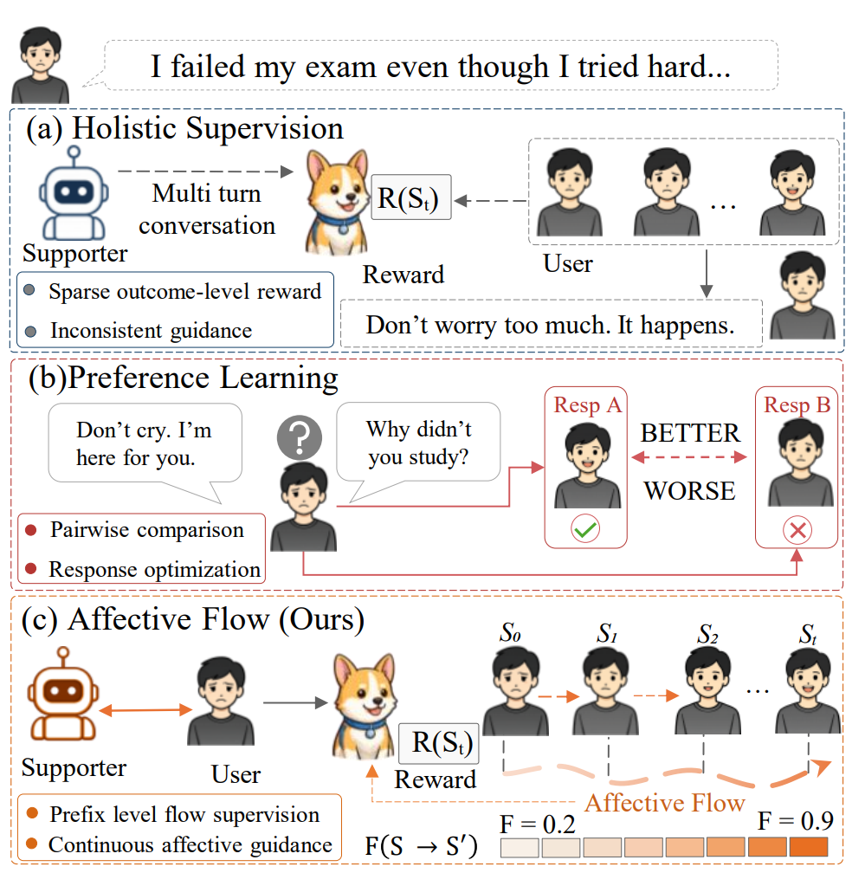
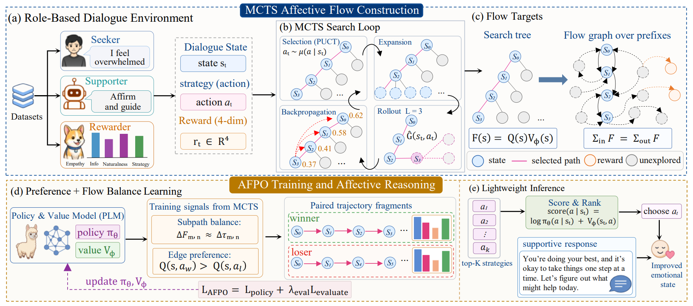

<p align="center">
  
</p>

<h2 align="center">
  <b>Affective Flow Language Model for Emotional Support Conversation</b>
</h2>

<p align="center">
  <a href="http://arxiv.org/abs/2602.08826"></a>&nbsp;
  <a href="LICENSE"></a>&nbsp;
  &nbsp;
  
</p>

<p align="center">
  <a href="https://arxiv.org/abs/2602.08826"></a>
  <a href="#methodology"></a>
  <a href="#quick-start"></a>
  <a href="#results-and-experiments"></a>
  <a href="#citation"></a>
</p>

<p align="center">
  
</p>
<p align="center"><sub>Figure 1. Overview of holistic supervision, preference learning, and AFlow.</sub></p>

## Overview

AFlow studies multi-turn Emotional Support Conversation (ESC) through strategy-level decisions. It builds dialogue trees with Monte Carlo Tree Search (MCTS), extracts trajectories from the search trees, and trains a strategy policy with Affective Flow Preference Optimization (AFPO). The supplementary scripts support automatic evaluation, pairwise preference evaluation, rollout analysis, ablations, and MCTS sensitivity experiments.

## Methodology

The pipeline combines a role-based dialogue environment, MCTS-based trajectory construction, and AFPO training with prefix-level flow supervision. At inference time, the trained policy and value model rank candidate support strategies.

<p align="center">
  
</p>
<p align="center"><sub>Figure 2. MCTS trajectory construction, AFPO training, and lightweight inference.</sub></p>

## Quick Start

### Environment

```bash
conda create -n esc_server python=3.10 -y
conda activate esc_server
```

Install PyTorch for the CUDA version on your machine using the [official PyTorch selector](https://pytorch.org/get-started/locally/), then install the remaining dependencies:

```bash
pip install -r requirements.txt
```

Optional packages:

```bash
pip install bitsandbytes              # quantized training
conda install -c conda-forge graphviz # analyze/draw_tree.py
```

Set the backbone path in `configs/train_emoflow.yaml` under `afpo_training.model_name`. Tree construction also requires the API key environment variable configured under `models.*.api_key_env`; keep credentials out of the repository.

### Run the pipeline

Build trees, summarize them, draw the search trees, and extract trajectories:

```bash
bash scripts/run_pipeline.sh
```

Train AFPO using the paths indexed in `analyze/tree_paths_rel.json`:

```bash
python scripts/train_afpo.py
```

To select GPUs with the launcher:

```bash
bash scripts/run_train.sh 0
bash scripts/run_train.sh 0,1
bash scripts/run_train.sh all
```

## Results and experiments

The repository includes scripts for evaluating strategy accuracy and text metrics, analyzing rollout behavior, comparing model responses pairwise, running training ablations, and sweeping MCTS settings.

```bash
# Automatic metrics
python scripts/eval_auto.py --eval-data <external_eval.jsonl> \
  --checkpoint output/afpo_cls/<run_or_ckpt>

# Rollout analysis
python scripts/eval_rollout.py --seed-data <external_eval.jsonl> \
  --checkpoint output/afpo_cls/<run_or_ckpt>

# Pairwise preference evaluation
python scripts/eval_pairwise.py --file-a <aflow_preds.jsonl> \
  --file-b <baseline_preds.jsonl> --judge-model <model>

# AFPO ablation
python scripts/train_afpo_ablation.py --variant wo_flow_balance
```

`eval_auto.py` reports strategy accuracy, Macro-F1, BLEU, ROUGE-L, METEOR, and diversity metrics. `eval_rollout.py` reports stage effectiveness, rewards by turn, and strategy entropy. See each script's `--help` output for options. MCTS sensitivity sweeps are available in `scripts/run_mcts_sensitivity.py`.

## Repository layout

```text
analyze/    Tree analysis and active tree/path indexes
configs/    Training and tree-building configuration
data/       Source data, prompts, strategies, and evaluation metrics
scripts/    Tree construction, training, evaluation, and experiment scripts
```

Processed data, runtime logs, and checkpoints may be generated by the pipeline and are not all tracked in Git. The default active metadata files are `analyze/tree_paths.json` and `analyze/tree_paths_rel.json`.

## Citation

See the [paper](https://arxiv.org/abs/2602.08826) for citation details.
